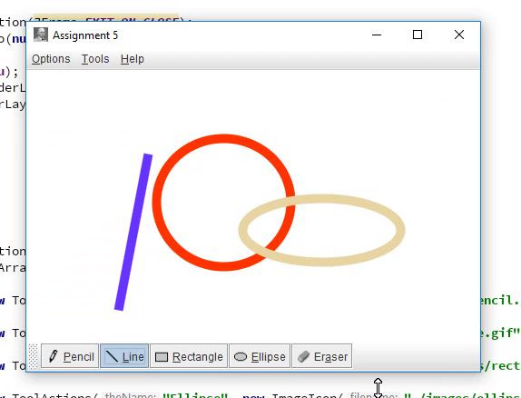

## PowerPaint

A microsoft paint replica built entirely from scratch.

This project displays an understanding of:
- Inheritance
- GUI/Swing design
- Graphics
- Actions/event handling
- Clean code design and practices.

This program is a drawing program, much like the original microsoft paint. It allows users to use a pencil, line, rectangle and ellipse drawing tool, as well as an eraser. This program operates the way a professional program of this type should, including only one tool selection at a time, operational shortcuts and mnemonics, and free of bugs and runtime errors. 

Note: I am currently rewriting this program using JAVAFX to show my understanding of both SWING and JAVAFX.

### Examples

